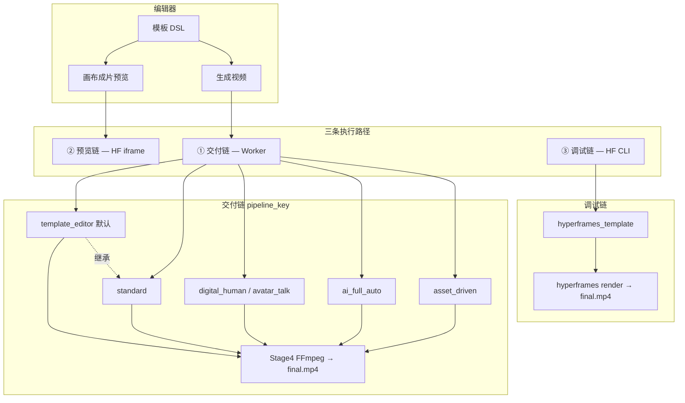

# Guide 领域词汇（共享语言）

| 术语 | 含义 |
|------|------|
| **四阶段管线** | 解析 → 场景图 → 分镜视频(TTS/唇形) → FFmpeg 组装 |
| **FFmpeg 单路径** | 成片仅一次 Stage4 编码；ASS 字幕 + xfade 转场 + 质感滤镜 |
| **HF 预览** | 编辑器内 HyperFrames HTML 实时预览；不用于交付二次渲染 |
| **模板编辑器流水线** | 默认导购出片路径（`template_editor`） |
| **动效样式** | 字幕 style_id、HF 转场、全局质感（grain/vignette/grade） |
| **单字幕轨** | 交付成片只烧录一层 ASS，禁止 FFmpeg+HF 双字幕 |
| **三条执行路径** | ① 交付（Worker + pipeline_key）② 预览（HF iframe，不交付）③ 调试（`hyperframes_template`，需环境开关） |
| **七条 pipeline_key** | `template_editor` / `standard` / `digital_human` / `avatar_talk` / `ai_full_auto` / `asset_driven` / `hyperframes_template` |

## 架构：三条路径 × 七条流水线

不是「三套出片系统」，而是 **预览 / 交付 / 调试** 分工 + 交付内部按场景选 `pipeline_key`。



### 分阶段对照（Worker）

| 阶段 | template_editor / standard | digital_human / avatar_talk | ai_full_auto / asset_driven | hyperframes_template |
|------|--------------------------|----------------------------|----------------------------|----------------------|
| Stage1 | `parse_template` | 同上 + 强制数字人 | LLM 或素材拆镜后解析 | TS composer → `index.html` |
| Stage2 | AI 场景图 | **跳过** | AI 场景图 / 素材 | **跳过** |
| Stage3 | TTS + 分镜 clip | TTS + 唇形 | 同左 | **跳过**（lint） |
| Stage4 | `assemble_final_video` | 同上 | 同上 | `hyperframes render` |

### 集成默认

```json
{ "pipeline_key": "template_editor", "input_mode": "template" }
```

详表见 [INTEGRATOR_QUICKSTART.md §9.1](./docs/INTEGRATOR_QUICKSTART.md#91-流水线-registrypipeline_key)。  
代码文件索引见 [PIPELINE_CODE_INDEX.md](./docs/PIPELINE_CODE_INDEX.md)。

## 验收命令

```bash
make smoke-integrator                    # 全链路 smoke（默认 template_editor）
make poll-render-job JOB=<id>            # 轻量轮询 ?summary=1
make verify-final-delivery JOB=<id>      # 成片单路径验收
make validate-render-job JOB=<id>        # 时间轴/字幕对齐审计
make test-guide-e2e                      # Playwright 37 项
make verify-delivery-complete            # 发布前全门禁（一键）
```

参考 E2E 任务：`c6b0e511-1b11-41d7-bbe9-3cd8b47db350`（飞鹤模板全链路 Worker 成片）。