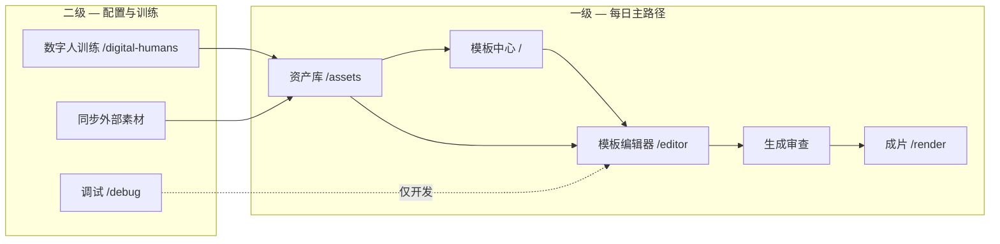

# 零一数字人导购平台 — 产品定义（V3）

> 基于 opentalking / OpenStoryline / HyperFrames / cenker-demo 交叉调研  
> 日期：2026-06-16 | 执行计划：`OPTIMIZATION_PLAN_V3.md`

## 一句话

**运营在资产库备好「品牌包 + 数字人 + 脚本 + 声音」，在模板编辑器里只做选择与编排，一键生成可复用的导购短视频。**

## 用户与场景

| 角色 | 目标 | 成功标准 |
|------|------|----------|
| 运营/导购运营 | 批量产出门店/品类短视频 | 30 分钟内完成首条可发布视频 |
| 品牌设计 | 维护品牌色、字体、镜头规范 | design.md + frame.md 一处维护，全局生效 |
| 技术/平台 | 稳定渲染、可审计 | Worker 四阶段 + 预览与成片一致 |

**非目标（本期不做）**：协作审片、C 端购物、完整 RAG 知识库文档、7 条流水线全部暴露给小白用户。

## 产品主干（主次关系）

**主路径**：资产库 → 选模板 → 选品牌/数字人/脚本/BGM → 编分镜 → 生成。  
**次路径**：数字人训练、外部目录同步、运维批量重拼。

## 资产模型（统一维护 vs 仅选择）

| 资产类型 | 维护位置 | 编辑器行为 | 数据来源 |
|----------|----------|------------|----------|
| 品牌包 | 资产库 · 品牌 | **仅选择** | opentalking `design.md` + `frame.md` |
| 字体库 | 品牌包内 `typography.fonts` | **仅选择** | opentalking design.md / OpenStoryline fonts |
| 镜头模板 frames | 品牌包内 `frames[]` | **仅选择**（添加分镜） | opentalking frame.md |
| 预设 presets | 品牌包内 | **仅选择**（版式/字幕/贴纸） | frame.md presets |
| 数字人 | 资产库 · 数字人 | **仅选择** | 训练产物 |
| 模板 | 资产库 · 模板 | 打开编辑器改 DSL | 剪映导入 / 预置 |
| 脚本 | 资产库 · 脚本 | **仅选择** | OpenStoryline script_templates |
| 声音 TTS/BGM | 资产库 · 声音 | **仅选择** | OpenStoryline bgms + opentalking bgms |
| 知识库 | 资产库 · 知识库 | 目录维护；**文档开发中** | 后续 RAG |
| 媒体 | 资产库 · 媒体 | **仅选择**（贴片/场景） | 上传 + 模板 asset_map |

## 与 HyperFrames 的关系

- **design.md**：品牌原子（色、字、圆角、间距）— 对应 HyperFrames 品牌 token。
- **frame.md**：镜头与合成（frames + presets + `hyperframesTemplate`）— 对应 HyperFrames 的「frame 翻译层」。
- **预览**：✅ 编辑器内 HF 实时预览（`buildPreviewHtml` + seek 驱动）= 编排验收；**成片** = Worker Stage1–4；品牌 token / 字体注入待 Phase D。

原则：**品牌包是唯一视觉真相源**；DSL 只存 `brand_pack_id`、`frame_template_id`、变量值，不复制整套预设。

## 功能缺口（V3 调研结论）

### 已解决（V2→V3）

- 统一资产库 `/assets`、画布拖拽同步、异构时间轴、HF 实时预览（Konva 主路径已移除）

### P0 — 阻断「品牌包闭环」

1. 品牌 payload 仅 6 个扁平字段，未存 `design_markdown` / `frame_markdown` / `presets` / `frames`。
2. `import-external-catalog` 只解析 design.md 颜色子集，**未导入 frame.md / 字体文件**。
3. 无字体库一等公民；`textStyles` / `subtitleStyles` 与编辑器 `subtitleStyles.ts` 双轨未打通。
4. 分镜无 `frame_template_id`；HF `hyperframesTemplate` 未挂接。
5. 编辑器 `BRAND_KITS` 硬编码 — 与资产库双数据源。

### P1 — 体验与 AI 原生

6. 编辑器认知负担高：7 Tab 资产库 + 编辑器内预置/工具栏/inspector 重复入口。
7. 无「从品牌包添加镜头」向导；变量（productName、price）与导购场景未绑定。
8. AI 能力分散：`ai_full_auto` 流水线、规则式「AI 优化描述」、外部脚本库未统一为「AI 推荐脚本/BGM/版式」。
9. 知识库文档占位但未产品化说明。

### P2 — 可删减代码/概念

10. `web/src/data/sceneImages.ts` 等静态 catalog 与资产库媒体重复 — 保留为 fallback，默认走资产库。
12. 导航「调试」对运营可见 — 应环境门控或移入设置。
13. `library_items` 与扁平 brand 表单 — 应升级为 `brand_pack` 单一 schema。
14. 硬编码 `DEFAULT_OPENTALKING` 路径 — 改为 UI 配置 + env。

## AI 原生能力（规划）

| 能力 | 输入 | 输出 | 参考 |
|------|------|------|------|
| 脚本推荐 | 品类/主题 + 可选知识库目录 | script 库条目 + 填入首镜旁白 | OpenStoryline 文风检索 |
| 分镜生成 | 品牌包 frames + 产品变量 | segments[] + frame_template_id | opentalking `generate-script` |
| BGM 推荐 | 脚本情绪 + scene/mood 标签 | voice/bgm 库条目 | OpenStoryline `select_bgm` |
| 版式推荐 | shotType + brand presets | layoutPreset → objects | opentalking Toolbar |
| design→frame 助手 | 上传 design.md | 建议 frame.md 补丁 | hyperframes.dev/design |
| 自然语言改镜 | 编辑器输入 | DSL diff（实验） | video-use |
| 视频提示词 | 外链生成场景 | Seedance/即梦结构 | seedance2-skill |

## 成功指标（V3 验收）

- 新用户：资产库同步后 **10 分钟内**完成「选品牌包 + 选数字人 + 选脚本 + 生成」。
- 品牌包：含 **≥15 字体**、**≥4 镜头**、**≥6 字幕预设**；选用后 HF 预览立即可见。
- 一致性：预览与成片字幕字体抽样 **3 模板一致**。
- 代码：删除 `BRAND_KITS`；`make test-guide` 绿；gitnexus-impact 无意外断裂。
- 认知：运营只需 **资产库 / 模板 / 生成** 三个词；编辑器无品牌维护入口。

## 竞品/参考取舍

| 来源 | 借鉴 | 不借鉴 |
|------|------|--------|
| opentalking | 品牌包 design+frame、资产库 Tab、Inspector 选品牌/镜头 | 记忆库、导出视频 Tab、市场克隆 |
| OpenStoryline | 脚本/BGM 目录、标签过滤、TTS 预设 | 全自动剪片工作流替代导购 DSL |
| HyperFrames | frame.md 语义、HF 预览、registry blocks | 完全用 HF 替代 Worker 口播链路 |
| cenker-demo | 分镜条、生成审查门、场景级素材应用 | 静态 JSON 场景库作为主数据源 |